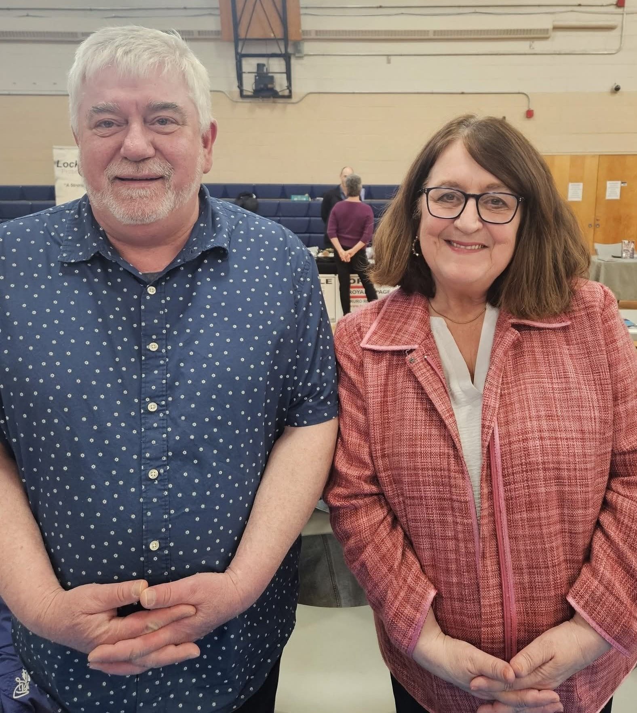

Title: Why Choose Us
Slug: why-choose-us
header_image: philosophy_of_care.png
header_image_alt: Philosophy of care
subtitle: Our mission is to provide competent, joyful, and attentive caregivers to seniors in their homes with the whole person in mind and at the forefront of all we do.

Personal freedoms are not diminished but enhanced and supported in a safe, familiar caring environment. At Alongside we believe that providing care extends beyond the basic needs of daily living. As a home care agency specializing in live-in care, we believe that all seniors should be treated with dignity in their own homes. Alongside supports and respects individual freedoms, rights, choices, and privacy of our clients. We come "alongside" to assist the individual and encourage independence where possible. We allow seniors to "age in place", connected to loved ones and community.

We are committed to being "alongside": caring for you and your loved ones every step of the way, every single day.

<section markdown="1">

## Who We Are

The Co-founders of Alongside Live-In Home Support are Jo-Anne MacDonald and Gary Laird. Combined they have over 7 decades of caring for the elderly in various health and home care work settings. They bring an extensive skill set, a high standard of care, and a compassionate management approach stemming from extensive hands on experience.

Seniors and their loved ones who find themselves in need of 24hr care face many challenges. Alongside services can bring you an individualized approach that is both cost effective and caring. Jo-Anne & Gary understand the need for a unique home care plan that suits the individual. They have experienced first hand that a cookie-cutter approach to home care does not honour the uniqueness of each client or their needs—nor that of the families.

Our caregivers are bonded, insured, and licensed. You can be confident a trustworthy individual is entering your/your loved ones home. Our employees are well prepared and meet Alongside standards to help seniors "age in place" in their home whether it be for the short or long term.

</section>

## Why choose Alongside Live-In Home Support?

- The client has an experienced caregiver alongside 24-7 in their home (except 4 hours per week for worker respite)
- Peace of mind for the client and loved ones. Be it short term or longer you retain service
- To support the elderly to remain at home with less risks of falling
- To enhance quality of lifestyle
- It is cost effective being billed daily rather than hourly. No additional fees like travel, etc
- So you or your loved one has more freedom, independence, and choice. There is flexibility in the schedule when the responsibility of the caregiver does not stop at 5pm.
- You get around the clock, compassionate care to age at home all day, every day
